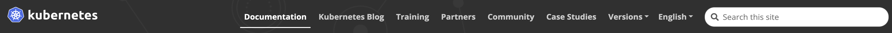

# UDS Docs Refresh Implementation

Date: 2024-09-19

## Status

Pending

## Context
The existing project at [uds.defenseunicorns.com](https://uds.defenseunicorns.com/) uses Hugo and a modified 
theme/template. We are considering the possibility of using [Starlight](https://starlight.astro.build/), an 
[Astro](https://astro.build/)-based library (built by the Astro team), which is already used for the Zarf docs.

Currently, the existing UDS docs repo sources its content from multiple repositories such as UDS Core and UDS CLI. 
This is done using [an integration script](https://github.com/defenseunicorns/uds-docs/blob/main/scripts/integrated-docs.sh). 
The script takes each provided repo and clones its docs folder into a `/repo-docs` folder in the root directory. The 
project’s [hugo.toml](https://github.com/defenseunicorns/uds-docs/blob/main/hugo.toml) file then has directives which 
mount those folders as if they were in the /content folder.

### Usability & Other Feedback
The current theme generates a top-level navigation for each folder in the root. This is why you see different items 
for each folder in the top navigation:


This may be confusing and can be better structured to provide a clearer narrative, as generally top navigation items 
are reserved for much broader subjects when in this case it's all really just UDS. For comparison, let's consider the 
Kubernetes website (which also happens to be built with Hugo):



While we don't need to be an exact copy by any means, you can see how the documentation is treated as a singular 
section.

Another challenge is that there is a lacking narrative of what an individual needs to understand in order to be 
successful with UDS. Tutorials may be helpful, but it's also very easy to follow a tutorial step-by-step and still not 
fully understand the technology itself, lowering the amount of absorbed information. The documentation does not 
establish a baseline expectation of prerequisite knowledge.

Feedback from Delivery has indicated that the site is lacking fit and finish and could be better organized; they also 
go directly to the projects themselves in order to investigate issues, which implies that the documentation is not as 
fully realized as it should be.

## Decision

[To be filled]

## Consequences

There are generally no obvious, major consequences in making this switch, and we could revert back to our existing site if
absolutely needed. Some positives:

- Better usability
- Easier maintenance
- Astro is more flexible to work with
- Potential to expand these processes to other products

## Implementation Details

### Document Structure & Sourcing
Per the above, we plan to make adjustments to our information architecture to improve its structure and navigability. 
It's very possible this may change based on feedback and/or discovery of currently unknown information. For brevity, 
here is a reduced example of what that looks like as of this writing:

```
Getting Started
    - Basic Requirements
Overview
    - Why UDS?
Structure
    - UDS Core
Technical Concepts
    - Kubernetes
    - Helm
    - Service Mesh
    - Istio
Reference
    - CLI
        - Schema Validation
    - CLI Commands
        - uds
Tutorials
    - Deploy with UDS Core
Troubleshooting
    - Common Issues
```

Getting Started sections as a top navigation item are a very common UX pattern in other technical documentation; the 
idea is to generally give the user an up front "taste" of the product before diving into more technical details. This 
section is not intended to be a tutorial section, and none of its content should be longer than about 15-30 minutes. 
In-depth tutorials will live in their own section.

While we want to continue to empower engineering to continue to own relevant docs, the current method of pulling them 
from various sources does not align with this structure.

### Methods of Implementation

In the updated information architecture, the UDS CLI has two separate folders under the Reference section; one for 
general CLI content, and another for CLI commands specifically. In addition, there may be troubleshooting document(s) 
that they may maintain as well. Each project will need to update its file structure to respect the updated information 
architecture.

The UDS docs repo will contain general documentation (see below), and any reference/engineering-owned documentation 
will live inside each project’s respective repo.

Assuming the UDS Docs repo (running on Hugo, which uses /content as its root) has this specific folder structure at 
its root, using the above example:

```
/docs
    /getting-started
    /overview
    /structure
    /concepts
    /reference
    /tutorials
    /troubleshooting
```
```
/docs
    /reference
        /cli
            schema-validation.md
            uds-runner.md
    /cli-commands
        uds.md
        [...]
    /troubleshooting
```

The `astro.config.mjs` file in this project will be configured to automatically generate the routes, e.g.:
```
[...]
label: 'Reference',
items: [
    {
        label: 'UDS CLI',
        autogenerate: {
            directory: 'reference/uds-cli'
        },
        collapsed: true
    },
[...]
```

An `assets` folder will probably also be required.

The integration script will copy the content into the main UDS `docs` folder when the project is built, in a slightly
different fashion but similar in concept.

### Tutorials
In either option above, we might consider adding an exception for tutorials and host them in their own repo. Developer 
tutorials can often have a user clone a repo as a starting point, and in our case we might have pre-built apps to work 
through existing scenarios.


## Alternatives Considered


## Open Questions

### Submission Process
There is no standard submission process and workflow for documentation review. We can add templates for both bug 
reports (e.g. problems with sample code, or the docs app itself) as well as proposals for new documentation, but the 
rest of this process is undefined.
- What factors determine whether certain documentation should be added?
- Who is able to issue a final approval to merge documentation?

### Document Categories
In the instance where certain docs are owned by engineers inside of their respective repos, we need to properly 
differentiate between those documents.

#### General Documents
These are “meta” level documents discussing topics which pertain to UDS but are not referential enough in nature to 
mandate being included in the code repo itself.

Factor(s) determining if a document is in this category:
- Is the frequency of non-housekeeping (e.g. typos) updates to the page’s content low?
- Is the page’s content less likely to be made obsolete by updates to UDS Core/CLI?
- Does the page’s content reference external, related subject matter (e.g. Kubernetes or Helm)?

External examples:
[Why you need Kubernetes and what it can do](https://kubernetes.io/docs/concepts/overview/#why-you-need-kubernetes-and-what-can-it-do)
[Helm Architecture](https://helm.sh/docs/topics/architecture/)
[Docker Grammar and Style Guide](https://docs.docker.com/contribute/style/grammar/)

Reference Documents
These are engineering-focused documents that pertain specifically to the usage of UDS products, and may also include some troubleshooting content as well.

Factor(s) determining if a document is in this category:
- Is the frequency of non-housekeeping updates to the page’s content high?
- Is the page’s content more likely to be made obsolete by updates to UDS Core/CLI?
- Is the user’s version of UDS Core/CLI relevant to the page’s content?
- Does the content directly reference the use of APIs, CLI commands, etc.?

We may wish to look at the [Diataxis framework’s definition](https://diataxis.fr/reference/) of reference documentation:

> Reference material contains propositional or theoretical knowledge that a user looks to in their work.
> 
> The only purpose of a reference guide is to describe, as succinctly as possible, and in an orderly way. Whereas the 
> content of tutorials and how-to guides are led by needs of the user, reference material is led by the product it 
> describes.
>
> In the case of software, reference guides describe the software itself - APIs, classes, functions and so on - and how
> to use them.
> Your users need reference material because they need truth and certainty - firm platforms on which to stand while 
> they work. Good technical reference is essential to provide users with the confidence to do their work.

It also discusses the difference between reference and explanation documents [elsewhere](https://diataxis.fr/reference-explanation/) 
on the site.

External examples:
- Kubernetes Reference
- Docker Reference

### Release Process
What is the release process for documentation? How often is it built and shipped? We are using Netlify for
deployment and this will automatically deploy with any merge into main. Perhaps this suffices for now, but eventually
we may deal with more complex issues like versioning.

### Writing Guidelines
There are no UDS-specific guidelines for writing documentation. We may want to review and adopt elements of
Zarf's [Documentation Style Guide](https://docs.zarf.dev/contribute/style-guide/) and evolve it over time as necessary.

### Versioning
There is no active plan for versioning docs. Where does this land as a priority? We don’t use a unified version
across UDS Core, CLI, etc., so how do we contend with this? The current docs do not address it and ideally all users
would be on the latest version(s) of everything, but realistically speaking there are likely situations where this
would not be the case and people may need to reference docs for older versions.

### Issue Tracking
Projects are able to add items from other repos automatically by default based on their labels, as discussed here:
https://docs.github.com/en/issues/planning-and-tracking-with-projects/automating-your-project/adding-items-automatically

There appears to be a limit to this and it probably won’t scale beyond a certain number of projects, which may or may 
not matter for this project.

Issues/PRs with a documentation label in UDS Core or UDS CLI are added to the board automatically. This way, people 
don’t need to necessarily go digging through filters and statuses.

## Next Steps
