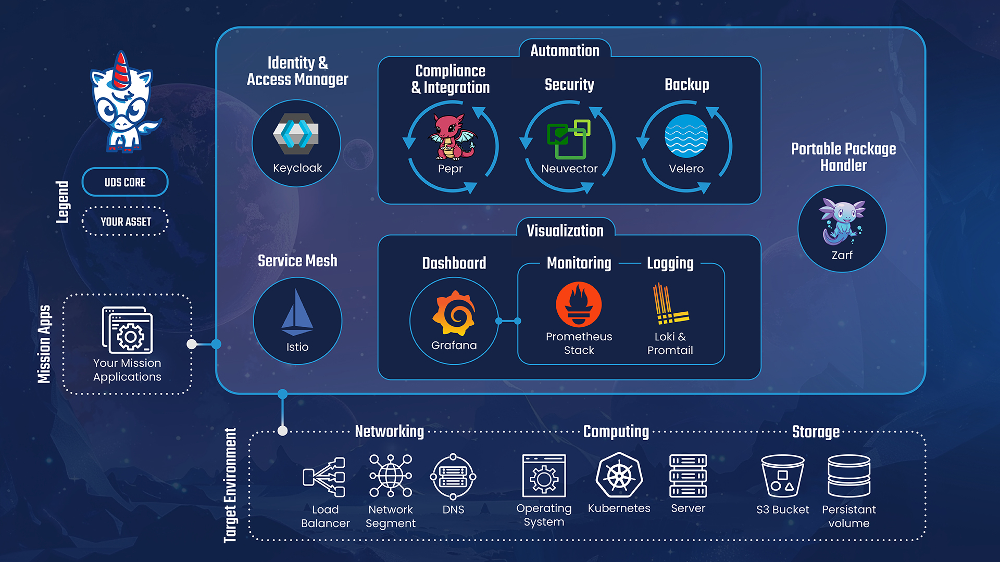

// ---
// title: Unicorn Delivery Service (UDS)
// tableOfContents: false
// lastUpdated: false
// ---
// import TwoColumnContent from "@astrojs/starlight/components/TwoColumnContent.astro";
// import { Card, CardGrid } from '@astrojs/starlight/components';
//
// [//]: # (<CardGrid>)
//
// [//]: # (    <Card title="Check this out" icon="open-book">)
//
// [//]: # (        Interesting content you want to highlight.)
//
// [//]: # (    </Card>)
//
// [//]: # (    <Card title="Other feature" icon="information">)
//
// [//]: # (        More information you want to share.)
//
// [//]: # (    </Card>)
//
// [//]: # (</CardGrid>)
//

return (

    <h2 id="accordion-collapse-heading-1">
        <button type="button" class="flex items-center justify-between w-full p-5 font-medium rtl:text-right text-gray-500 border border-b-0 border-gray-200 rounded-t-xl focus:ring-4 focus:ring-gray-200 dark:focus:ring-gray-800 dark:border-gray-700 dark:text-gray-400 hover:bg-gray-100 dark:hover:bg-gray-800 gap-3" data-accordion-target="#accordion-collapse-body-1" aria-expanded="true" aria-controls="accordion-collapse-body-1">
            What is Flowbite?
            <svg data-accordion-icon class="w-3 h-3 rotate-180 shrink-0" aria-hidden="true" xmlns="http://www.w3.org/2000/svg" fill="none" viewBox="0 0 10 6">
                <path stroke="currentColor" stroke-linecap="round" stroke-linejoin="round" stroke-width="2" d="M9 5 5 1 1 5"/>
            </svg>
        </button>
    </h2>
    

        

            
Flowbite is an open-source library of interactive components built on top of Tailwind CSS including buttons, dropdowns, modals, navbars, and more.

            
Check out this guide to learn how to <a href="/docs/getting-started/introduction/" class="text-blue-600 dark:text-blue-500 hover:underline">get started</a> and start developing websites even faster with components on top of Tailwind CSS.

        

    

    <h2 id="accordion-collapse-heading-2">
        <button type="button" class="flex items-center justify-between w-full p-5 font-medium rtl:text-right text-gray-500 border border-b-0 border-gray-200 focus:ring-4 focus:ring-gray-200 dark:focus:ring-gray-800 dark:border-gray-700 dark:text-gray-400 hover:bg-gray-100 dark:hover:bg-gray-800 gap-3" data-accordion-target="#accordion-collapse-body-2" aria-expanded="false" aria-controls="accordion-collapse-body-2">
            Is there a Figma file available?
            <svg data-accordion-icon class="w-3 h-3 rotate-180 shrink-0" aria-hidden="true" xmlns="http://www.w3.org/2000/svg" fill="none" viewBox="0 0 10 6">
                <path stroke="currentColor" stroke-linecap="round" stroke-linejoin="round" stroke-width="2" d="M9 5 5 1 1 5"/>
            </svg>
        </button>
    </h2>
    

        

            
Flowbite is first conceptualized and designed using the Figma software so everything you see in the library has a design equivalent in our Figma file.

            
Check out the <a href="https://flowbite.com/figma/" class="text-blue-600 dark:text-blue-500 hover:underline">Figma design system</a> based on the utility classes from Tailwind CSS and components from Flowbite.

        

    

    <h2 id="accordion-collapse-heading-3">
        <button type="button" class="flex items-center justify-between w-full p-5 font-medium rtl:text-right text-gray-500 border border-gray-200 focus:ring-4 focus:ring-gray-200 dark:focus:ring-gray-800 dark:border-gray-700 dark:text-gray-400 hover:bg-gray-100 dark:hover:bg-gray-800 gap-3" data-accordion-target="#accordion-collapse-body-3" aria-expanded="false" aria-controls="accordion-collapse-body-3">
            What are the differences between Flowbite and Tailwind UI?
            <svg data-accordion-icon class="w-3 h-3 rotate-180 shrink-0" aria-hidden="true" xmlns="http://www.w3.org/2000/svg" fill="none" viewBox="0 0 10 6">
                <path stroke="currentColor" stroke-linecap="round" stroke-linejoin="round" stroke-width="2" d="M9 5 5 1 1 5"/>
            </svg>
        </button>
    </h2>
    

        

            
The main difference is that the core components from Flowbite are open source under the MIT license, whereas Tailwind UI is a paid product. Another difference is that Flowbite relies on smaller and standalone components, whereas Tailwind UI offers sections of pages.

            
However, we actually recommend using both Flowbite, Flowbite Pro, and even Tailwind UI as there is no technical reason stopping you from using the best of two worlds.

            
Learn more about these technologies:

            <ul class="ps-5 text-gray-500 list-disc dark:text-gray-400">
                <li><a href="https://flowbite.com/pro/" class="text-blue-600 dark:text-blue-500 hover:underline">Flowbite Pro</a></li>
                <li><a href="https://tailwindui.com/" rel="nofollow" class="text-blue-600 dark:text-blue-500 hover:underline">Tailwind UI</a></li>
            </ul>
        

    

The Unicorn Delivery Service (UDS) enables secure software delivery into highly regulated or egress-limited environments enabling your teams to deploy and run the mission-critical applications required, wherever needed. UDS offers a comprehensive suite of tools tailored for mission operations, spanning software development, generative AI, defensive cyber, collaboration, and secure access management. If a required mission applications is not present in the ecosystem, users have the ability to choose a commercial or open-source application and specify the target environment for implementation.

                                                                                                                                                                                                                                                                                                                                                                                                                                                                                                                                                                                                           UDS integrates with Open Security Controls Assessment Language (OSCAL) to streamline Authority to Operate (ATO) processes, enabling secure and compliant software deployments. The open-source platform is designed to facilitate repeatable, reliable, and secure runtime environments to deploy mission applications into any environment.

[//]: # (## Key Features)

    [//]: # ()
        [//]: # (**Declarative Baseline:**  Rapidly establishes secure and repeatable runtime environments via declarative baselines. GitOps workflows manage declarative baselines to ensure consistent, efficient deployment and safeguard critical applications.)

            [//]: # ()
                [//]: # (**Software Capabilities:** Ensures continuous improvement and adaptation through synchronization with upstream providers, utilization of hardened images, and testing against common platforms and infrastructures.)

                    [//]: # ()
                        [//]: # (**Infrastructure Agnostic:** Provides flexible software deployment across classified and unclassified cloud, on-premises, and edge environments, ensuring that your software successfully deploys and runs wherever the mission needs it.)

                            [//]: # ()
                                [//]: # (**No Data or Vendor Lock:** Leverages open-source technologies to ensure data sovereignty and enhance flexibility while eliminating the limitations of data lock-in and vendor constraints.)

                                    [//]: # ()
                                        [//]: # (<>)

                                            [//]: # ()
                                                [//]: # (</>)

                                                    <a href="#" class="block max-w-sm p-6 bg-white border border-gray-200 rounded-lg shadow hover:bg-gray-100 dark:bg-gray-800 dark:border-gray-700 dark:hover:bg-gray-700">
                                                        <h3 class="mb-2 text-2xl font-bold tracking-tight text-gray-900 dark:text-white">Get Started with UDS</h3>
                                                        
Here are the biggest enterprise technology acquisitions of 2021 so far, in reverse chronological order.

                                                        <ul>
                                                            <li>Test</li>
                                                        </ul>
                                                    </a>

)
