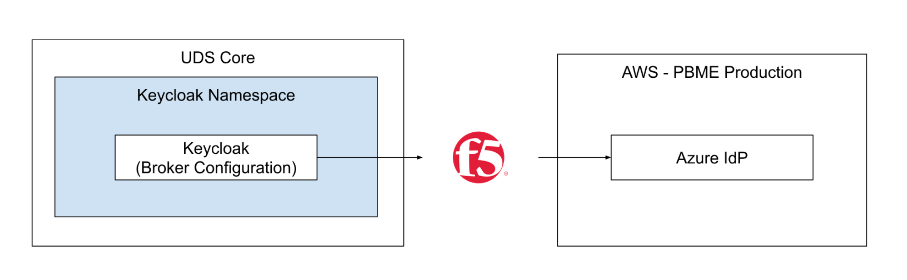
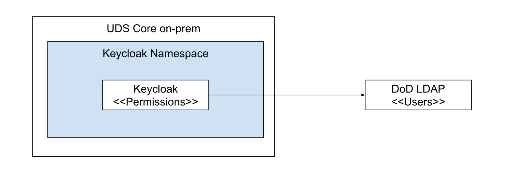

This page contains Keycloak Architecture Blueprints that help Mission Heroes get started quickly

## Project Blue

Project Blue is focused on deploying software for model-based maintenance and logistics capabilities in support of the Navy’s COLUMBIA (CLB) Class Submarine program.  Defense Unicorns administers the Project Blue Mission Environment (PBME), a government owned AWS cloud environment, which hosts the CLB 3D model as well as other mission applications.

Tofu it using `./adapt-keycloak project-blue`

## Air Force

The Air Force Life Cycle Management Center Defense Cyber Operation (AFLCMC/HNCD) is responsible for arming the Air Force’s Defensive Cyber Operations Community, which is in turn accountable for defending the Air Force Network, select Combatant Command systems, and aiding foreign partners in defensive cyber.

Tofu it using `./adapt-keycloak air-force`