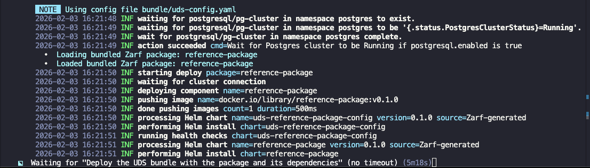

This guide highlights common roadblocks in UDS Package deployments and outlines general debugging techniques.

### Package "Stuck" in Deploying State
A UDS Package may occasionally appear to stall during deployment. This section outlines a common scenario and a practical approach to diagnosing the issue.

The example below reflects a terminal session with a deployment of the UDS Package `reference-package`, that has remained on the same deployment step for several minutes without progressing.

**Deployment Stalled for 5+ Minutes**



:::tip
If you prefer a UI-based workflow, you can inspect events using K9s or `uds zarf tools monitor`.
:::
#### Troubleshooting Command
When troubleshooting, it is common to inspect `Pods` or `Deployments`. However, in some cases, those resources may not yet exist or may not provide enough detail to explain the delay. In these situations, reviewing namespace `Events` is often the most effective way to identify the underlying issue.

```sh
kubectl get events -n reference-package
```

**Output**
```sh
LAST SEEN   TYPE      REASON              OBJECT                                    MESSAGE
8m26s       Warning   FailedCreate        replicaset/reference-package-674cc4c88b   Error creating: admission webhook "pepr-uds-core.pepr.dev" denied the request: Pod level securityContext does not meet the non-root user requirement.
```
This message indicates that the `pepr` admission webhook rejected the request because the application’s Helm chart is configured to run the container as the root user, which violates the enforced non-root security policy.

To resolve this particular issue, update the application’s security configuration in `values/common-values.yaml` (or the appropriate values file for the chart). The exact configuration depends on the chart, but an  example is shown below:

```yaml
podSecurityContext:
  runAsUser: 1000
  runAsGroup: 1000
  fsGroup: 1000

securityContext:
  capabilities:
    drop:
    - ALL
  readOnlyRootFilesystem: true
  runAsNonRoot: true
  allowPrivilegeEscalation: false
```

### How Can I Remove a Package From the Cluster?
- List installed packages using [zarf package list](https://docs.zarf.dev/commands/zarf_package_list/)
- Remove isntalled packages using [zarf package remove](https://docs.zarf.dev/commands/zarf_package_remove/)

### Kubernetes Troubleshooting
- [Kubernetes Troubleshooting Clusters Guide](https://kubernetes.io/docs/tasks/debug/debug-cluster/)
- [Kubernetes Troubleshooting Applications Guide](https://kubernetes.io/docs/tasks/debug/debug-application/)

### Helm Debugging
A solid understanding of Helm is highly beneficial when troubleshooting deployments. The following Helm commands are commonly used during debugging and can help diagnose and resolve issues efficiently.

- [helm template](https://helm.sh/docs/helm/helm_template/) - If you have a helm template you believe is not configured properly.
- [helm values](https://helm.sh/docs/helm/helm_show_values/) - If you want to view an upstream chart `Values.yaml` locally. 

  `helm values` example:

  ```sh
  helm show values oci://ghcr.io/uds-packages/reference-package/helm/reference-package
  ```

